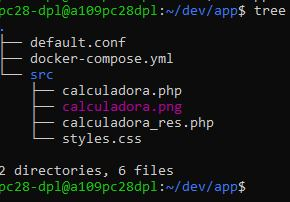
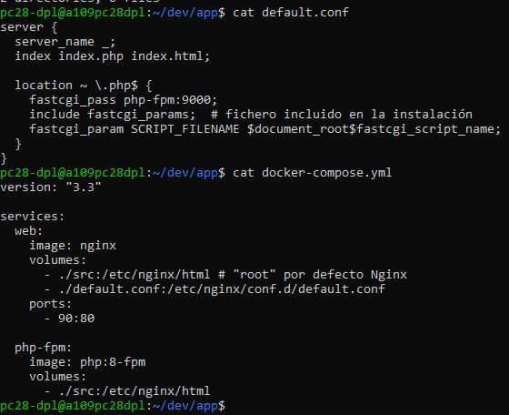
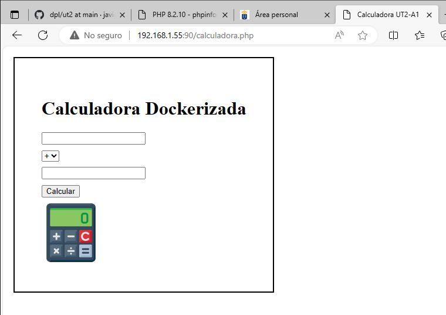
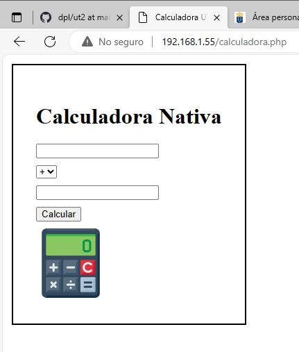

# TÍTULO DE LA PRÁCTICA

***Nombre:*** Javier García Hernández 
***Curso:*** 2º de Ciclo Superior de Desarrollo de Aplicaciones Web.

### ÍNDICE

+ [Introducción](#id1)
+ [Objetivos](#id2)
+ [Material empleado](#id3)
+ [Desarrollo](#id4)
+ [Conclusiones](#id5)

#### ***Introducción***. 

La arquitectura web más extendida es el modelo <b>cliente/servidor</b>. El cliente realiza peticiones que son atendidas por el servidor, quien ofrece uno o más servicios cuando le son solicitados. El cliente se encuentra en la capa homónima dentro de la arquitectura, mientras que el servidor ocupa diferentes capas: capa de presentación y capa de lógica de negocio. Respecto de las capas del modelo OSI, el servidor se encuentra englobado en la capa de aplicación. 

#### ***Objetivos***. 

El objetivo de esta práctica es desplegar una pequeña aplicación PHP utilizando Nginx. Se realizará de dos formas: en entorno nativo y en entorno 'dockerizado'.

#### ***Material empleado***. 

Para la realización de esta práctica se emplea un PC con sistema operativo Windows, en el que se instala el hipervisor de Oracle <b>VirtualBox</b>. Nginx correrá en una máquina virtual con sistema operativo Linux. Se instalará también <b>PHP-FPM</b>, ya que <b>Nginx</b> no puede manejar código PHP y será necesario redirigir las peticiones que lo requieran a dicho servicio mediante un <b>socket unix</b>. Para actuar como cliente se establecerá una conexión <b>ssh</b> entre la máquina real y la máquina virtual, pudiendo así trabajar desde una terminal de la máquina real además de utilizar el navegador de la misma como cliente. 

También se instalará <b>Docker</b> en la máquina virtual para poder realizar el despliegue 'dockerizado'.

#### ***Desarrollo***. 

### Calculadora Dockerizada:

En primer lugar se crea una carpeta para el proyecto. En esta carpeta estará otra carpeta 'src' que albergará los códigos fuente y las imágenes utilizadas, así como el fichero de configuración del sitio web y el fichero de configuración de la composición de servicios (el 'yaml'). 

Se indica en el 'yaml' que se quiere persistencia de datos mediante la creación de volúmenes en la máquina virtual. La carpeta './src' de la máquina virtual se corresponderá con la carpeta '/etc/nginx/html' del contenedor y, de igual forma, el fichero './default.conf' de la máquina virtual se corresponderá con el fichero '/etc/nginx/conf.d/default.conf' del contenedor. Lo mismo se define para el servicio 'php-fpm'.

Una vez definida la composición de servicios e indicado de dónde obtener la información para la aplicación, podemos enviar una solicitud desde el navegador de la máquina real.

### Calculadora Nativa:

Un problema que surge con esta parte es el tema de los permisos a la hora de acceder a ficheros por parte de Nginx. Cuando se intenta acceder a ficheros dentro del home del usuario da un error 403. 

Una posible solución es albergar los ficheros de la aplicación en la carpeta por defecto de Nginx: /usr/share/nginx/html. De esta forma, cuando se pide 'calculadora.php' desde el navegador Nginx podrá servir los ficheros de la aplicación.

#### ***Conclusiones***. 

La dockerización de aplicaciones facilita en gran medida las tareas de despliegue y configuración en general. Se evitan problemas de conflictos entre las configuraciones e instalaciones ya existentes y las nuevas necesidades que van surgiendo. Vale mucho la pena familiarizarse con el uso de Docker y herramientas similares de cara a trabajar como desarrollador. 