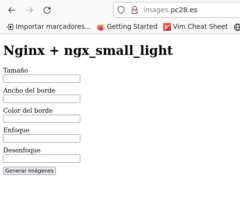
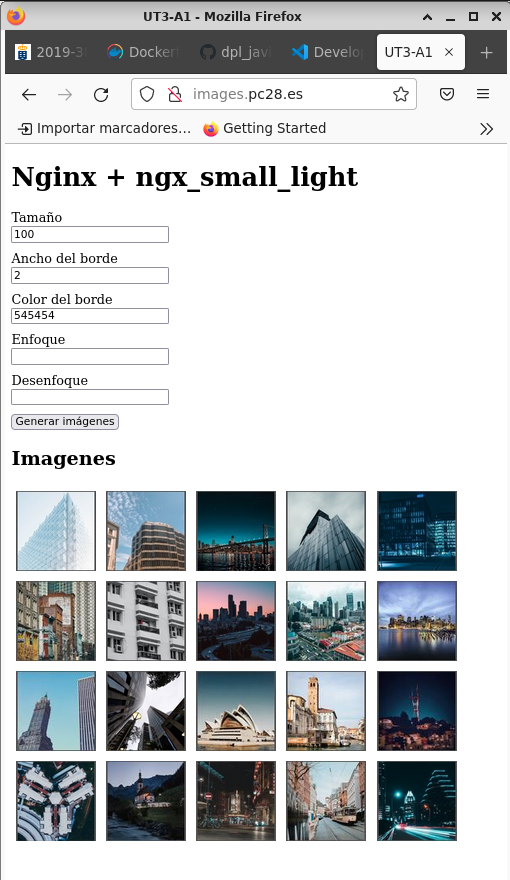

# UT3-A1

***Nombre:*** Javier García Hernández 
***Curso:*** 2º de Ciclo Superior de Desarrollo de Aplicaciones Web.

### ÍNDICE

+ [Introducción](#id1)
+ [Objetivos](#id2)
+ [Material empleado](#id3)
+ [Desarrollo](#id4)
+ [Conclusiones](#id5)

#### ***Introducción***. 

Un mismo servidor web puede albergar varios servicios, cada uno de ellos en su correspondiente <b>Host Virtual</b>, en Nginx <b>Server Block</b>. Configurando estos servicios por separado podemos distribuir las tareas de manera más eficiente y facilitamos el mantenimiento. Otra forma de distribución de funcionalidades propia de Nginx es su <b>modularidad</b>. Mediante la instalación de diferentes módulos podemos incorporar nuevas funcionalidades a nuestra instalación de Nginx.

#### ***Objetivos***. 

El objetivo de esta práctica es desplegar una pequeña aplicación en su propio <b>Server Block</b> para atender peticiones a su <b>dominio (server_name)</b>. Se instalará el <b>módulo 'ngx_small_light'</b> para elaborar la aplicación.

#### ***Material empleado***. 

Para la realización de esta práctica se emplea un PC con sistema operativo Linux, en el que se instala el hipervisor de Oracle <b>VirtualBox</b>. Nginx correrá en una máquina virtual con sistema operativo Linux. Se instalará también <b>PHP-FPM</b>, ya que <b>Nginx</b> no puede manejar código PHP y será necesario redirigir las peticiones que lo requieran a dicho servicio mediante un <b>socket unix</b>. Para actuar como cliente se establecerá una conexión <b>ssh</b> entre la máquina real y la máquina virtual, pudiendo así trabajar desde una terminal de la máquina real además de utilizar el navegador de la misma como cliente. 

#### ***Desarrollo***. 

### Instalación del módulo ngx_small_light:

En primer lugar instalamos las dependencias requeridas por el módulo:

    sudo apt install -y build-essential imagemagick libpcre3 libpcre3-dev libmagickwand-dev

Luego descargamos el códgio fuente del módulo desde el repositorio:

    git clone https://github.com/cubicdaiya/ngx_small_light.git /tmp/ngx_small_light

En la carpeta donde hemos clonado el repositorio realizamos la "configuración":

    cd /tmp/ngx_small_light/ | ./setup

Descargamos el código fuente de Nginx:

    curl -sL https://nginx.org/download/nginx-$(/sbin/nginx -v |& cut -d '/' -f2).tar.gz | tar xvz -C /tmp

Compilamos como módulo dinámico:

    ./configure --add-dynamic-module=../ngx_small_light --with-compat

Generamos la librería dinámica:

    make modules

Copiamos el fichero <b>.so</b> a la carpeta desde la que se cargan los módulos dinámicos de Nginx:

    sudo cp objs/ngx_http_small_light_module.so /etc/nginx/modules

Para que el módulo se cargue dinámicamente, añadimos la directiva <b>load_module</b> al fichero <b>nginx.conf</b>:

    load_module /etc/nginx/modules/ngx_http_small_light_module.so;

Configuramos el <b>Server Block</b>:

	server {
		listen 80;
		server_name images.pc28.es;
		root /usr/share/nginx/images.pc28;
		index index.html;

		location /img {	    
			small_light on;
				small_light_getparam_mode on;
		}	   
	}

Ahora solo falta tener en cuenta el formato utilizado por el módulo a la hora de construir las <b>url</b> de las imágenes:

	img.src= `http://images.pc28.es/img/${img.id}.jpg?dw=${dw}&bw=${bw}&bc=${bc}&sharpen=${focus}&blur=${blur}`;

### Aplicación nativa:

Al cargar la página podemos incluir los filtros que queramos para las imágenes y solicitar que se carguen.

La aplicación aplica dichos filtros a la hora de construir las urls de las imágenes, de forma que nginx pueda servirlas con las modificaciones correspondientes.

### Aplicación dockerizada:

Para poder dockerizar la aplicación debemos indicar los pasos a seguir para la instalación del módulo ngx_small_light. Utilizando un <b>Dockerfile</b> se pueden dejar definidos los pasos necesarios para compilar y configurar el módulo.

	# syntax=docker/dockerfile:1
	
	FROM nginx:1.24.0
	RUN apt update && apt install -y gcc make imagemagick libpcre3 libpcre3-dev libmagickwand-dev pkg-config curl tar gzip git
	RUN git clone https://github.com/cubicdaiya/ngx_small_light.git /tmp/ngx_small_light
	RUN curl -sL https://nginx.org/download/nginx-1.24.0.tar.gz | tar xvz -C /tmp
	WORKDIR "/tmp/ngx_small_light"
	RUN ./setup
	WORKDIR "/tmp/nginx-1.24.0"
	RUN ./configure --add-dynamic-module=../ngx_small_light --with-compat
	RUN make modules
	RUN mkdir -p /etc/nginx/modules
	RUN cp objs/ngx_http_small_light_module.so /etc/nginx/module

Una vez definido el Dockerfile, se indica en un .yaml cual sería la forma de lanzar el contenedor, asignando puertos, ficheros, etc.
	
	version: "3.3"
	
	services:
	  web:
	    build: .
	    volumes:
	      - /usr/share/nginx/images.pc28:/usr/share/nginx/html
	      - /etc/nginx/conf.d/images_docker.conf:/etc/nginx/conf.d/default.conf
	      - /etc/nginx/nginx_docker:/etc/nginx/nginx.conf
	    ports:
	      - 91:80 #maquina/docker

#### ***Conclusiones***. 

Con el uso de Dockerfile se puede reproducir facilmente la instalación necesaria para poner en marcha una aplicación. Un aspecto interesante es tener los códigos fuente y las configuraciones disponibles en un repositorio remoto y descargarlas durante la construcción de la imagen, pudiendo conseguir así el mismo contenedor sin importar la máquina anfitriona.
