

# UT4-A1

***Nombre:*** Javier García Hernández 
***Curso:*** 2º de Ciclo Superior de Desarrollo de Aplicaciones Web.

## ÍNDICE

+ [Introducción](#id1)
+ [Objetivos](#id2)
+ [Material empleado](#id3)
+ [Desarrollo](#id4)
+ [Conclusiones](#id5)

## ***Introducción***. 

Mediante el uso de un <b>VPS (Virtual Private Server)</b> podemos desplegar aplicaciones sin tener que encargarnos del mantenimiento de los servidores. A la hora de desplegar una aplicación, primero se trabaja en un <b>entorno de desarrollo</b>, dónde se puede comprobar que todo funciona correctamente, y luego se realiza un despliegue al <b>entorno de producción</b>.

A la hora de elaborar aplicaciones en cualquier lenguaje de programación, es muy conveniente utilizar <b>frameworks</b>. Como su propio nombre indica, los <b>frameworks</b> proporcionan un <i>marco de trabajo</i> que pone a disposición del programador una serie de herramientas a cambio de tener que ajustarse a las reglas establecidas por dicho marco.

## ***Objetivos***. 

El objetivo de esta práctica es desplegar una aplicación en un <b>entrono de desarrollo</b> y luego, mediante un <b>script</b>, desplegarla en un <b>entorno de producción</b>. 

## ***Material empleado***. 

Para la realización de esta práctica se emplea un PC con sistema operativo Linux, en el que se instala el hipervisor de Oracle <b>VirtualBox</b>. Éste será nuestro <b>entorno de desarrollo</b>. Por otro lado, se dispondrá de una máquina virtual remota, en un <b>VPS de Azure (Microsoft).</b> Éste será nuestro <b>entorno de producción.</b>

La aplicación a desplegar se elaborará en <b>Laravel</b>, un <b>framework</b> para aplicaciones desarrolladas con PHP.

El código de la aplicación y el <b>script de despliegue</b> se alojarán en un <b>repositorio de GitHub</b>.

El sistema gestor de base de datos que se utilizará es <b>Postgresql</b>. Se instalará un <b>administrador de Postgresql: pgAdmin</b>. Este administrador dispone de interfaz gráfica y es de código abierto. 

Para lanzar el servidor pgAdmin utilizaremos una <b>Intefaz de Pasarela de Servidor Web (WSGI): gunicorn.</b>

Para el despliegue en producción se utilizará <b>Cerbot</b>, una herramienta de certificación automática.

## ***Desarrollo***. 

### Preparación del entorno de desarrollo:

#### Instalación de PostgreSQL

Actualizar los repositorios:

	sudo apt update

Instalación de paquetes de soporte para Postgresql:

	sudo apt install -y apt-transport-https

Descargamos la clave de firma para el repositorio oficial de PostgreSQL:

	url -fsSL https://www.postgresql.org/media/keys/ACCC4CF8.asc | sudo gpg --dearmor -o /etc/apt/trusted.gpg.d/postgresql.gpg

Añadimos el repositorio oficial de PostgreSQL:

	echo "deb http://apt.postgresql.org/pub/repos/apt/ $(lsb_release -cs)-pgdg main" | sudo tee /etc/apt/sources.list.d/postgresql.list > /dev/null

Actualizamos de nuevo los repositorios:

	sudo apt update

Instalamos PostgreSQL:

	sudo apt install -y postgresql

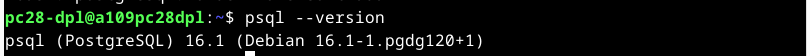

#### Configuración de la base de datos

Accedemos al intérprete de postgresql:

	sudo -u postgres psql	

Creamos un usuario y una base de datos que sea de su propiedad:

	CREATE USER travelroad_user WITH PASSWORD 'xxxx';

	CREATE DATABASE travelroad WITH OWNER travelroad_user;

	\q

Accedemos al intérprete de postgresql con el usuario creado y su base de datos:

	psql -h localhost -U travelroad_user travelroad

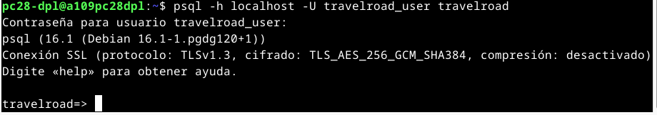

Creamos la tabla 'places':

	CREATE TABLE places(
		id SERIAL PRIMARY KEY,
		name VARCHAR(255),
		visited BOOLEAN);

Cargamos datos desde un fichero csv:

	curl -o /tmp/places.csv https://raw.githubusercontent.com/sdelquin/dpl/main/ut4/files/places.csv

	psql -h localhost -U travelroad_user -d travelroad -c "\copy places(name, visited) FROM '/tmp/places.csv' DELIMITER ','"

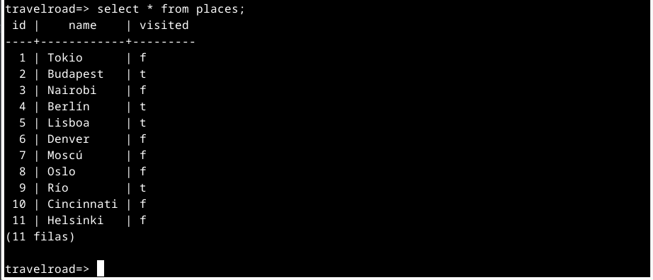

#### Instalación de pgAdmin

Creación de carpetas con permisos adecuados:

	sudo mkdir /var/lib/pgadmin
	sudo mkdir /var/log/pgadmin
	sudo chown $USER /var/lib/pgadmin
	sudo chown $USER /var/log/pgadmin

Creación de un entorno virtual de Python (en el $HOME del $USER):

	python -m venv pgadmin4
	source pgadmin4/bin/activate
	pip install pgadmin4

Lanzo el script de configuración:

	pgadmin4

Configuramos un usuario 'maestro'.

#### Instalación del WSGI gunicorn

Instalamos gunicorn en el entorno virtual:

	pip install gunicorn

Lanzamos el servidor de pgAdmin utilizando gunicorn:

	gunicorn --chdir pgadmin4/lib/python3.11/site-packages/pgadmin4 --bind unix:/tmp/pgadmin4.sock pgAdmin4:app

#### Configurar virtual host en Nginx para pgAdmin

Creamos el fichero de configuración del servidor:

	sudo nano /etc/nginx/conf.d/pgadmin.conf

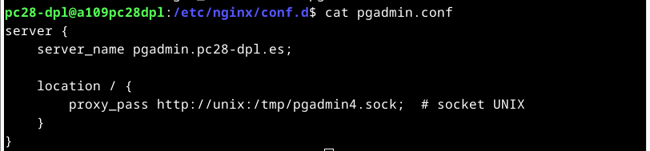

Ahora podemos entrar utilizando el 'server_name' y las credenciales de la cuenta 'maestra':

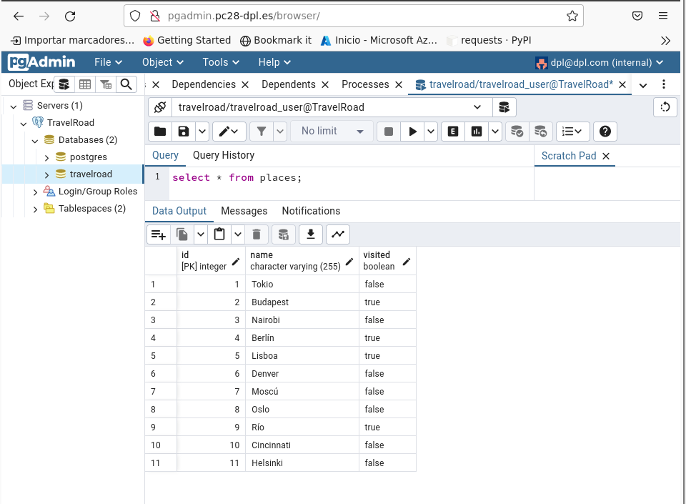

#### Demonizando el servicio

Creamos el fichero de configuración del servicio:

	sudo nano /etc/systemd/system/pgadmin.service

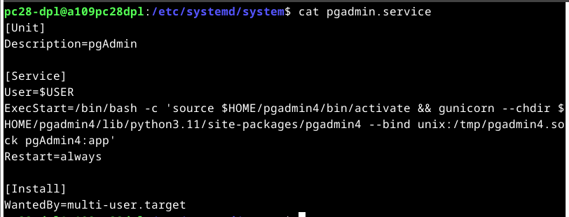

Una vez creado el fichero de configuración, habilitamos el servicio para que se lance al iniciar el SO:

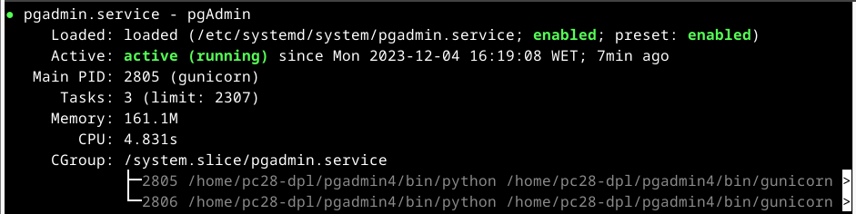

#### Instalación de Laravel

Instalamos composer, un gestor de dependencias para PHP:

	curl -fsSL https://raw.githubusercontent.com composer/getcomposer.org/main/web/installer | php -- --quiet | sudo mv composer.phar /usr/local/bin/composer

Instalamos los módulos de PHP necesarios para Laravel:

	sudo apt install -y php8.2-mbstring php8.2-xml php8.2-bcmath php8.2-curl php8.2-pgsql

Creamos la estructura base del proyecto mediante composer:

	composer create-project laravel/laravel travelroad

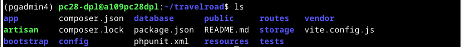

Modificamos credenciales de acceso en el .env del proyecto:

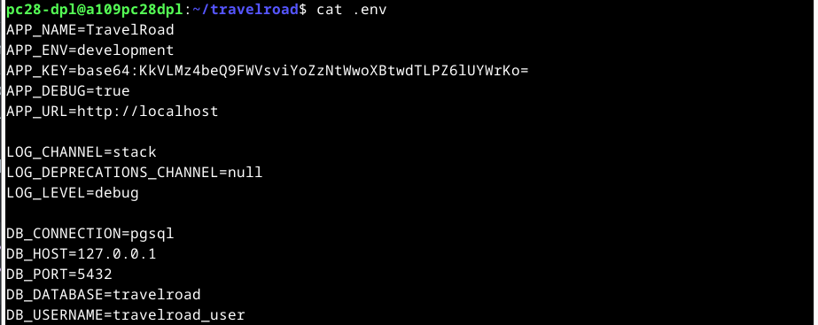

Damos permisos adecuados a los ficheros del proyecto, para que Nginx y PHP-FPM puedan acceder:

	sudo chgrp -R nginx storage bootstrap/cache
	sudo chmod -R ug+rwx storage bootstrap/cache

Configuramos el <b>server block</b> para la aplicación:

	server {
		server_name travelroad;
		root /home/pc28-dpl/travelroad/public;

		index index.html index.htm index.php;

		location / {
			try_files $uri $uri/ /index.php?$query_string;
		}

		location ~ \.php$ {
			fastcgi_pass unix:/var/run/php/php8.2-fpm.sock;
			fastcgi_param SCRIPT_FILENAME $realpath_root$fastcgi_script_name;
			include fastcgi_params;
		}
	}

Para que Nginx pueda manipular ficheros en /home es necesario cambiar los permisos:

	chmod og+rX /home /home/pc28-dpl

Por último configuramos la lógica de negocio de nuestra aplicación. Para necesitamos editar vistas y plantilla.

La vista:

	<?php

	// https://laravel.com/api/6.x/Illuminate/Support/Facades/DB.html
	use Illuminate\Support\Facades\DB;

	Route::get('/', function () {
	$wished = DB::select('select * from places where visited = false');
	$visited = DB::select('select * from places where visited = true');

	return view('travelroad', ['wished' => $wished, 'visited' => $visited]);
	});

La plantilla:

	<html>
	<head>
		<title>Travel List</title>
	</head>

	<body>
		<h1>My Travel Bucket List</h1>
		<h2>Places I'd Like to Visit</h2>
		<ul>
		@foreach ($wished as $place)
		<li>{{ $place->name }}</li>
		@endforeach
		</ul>

		<h2>Places I've Already Been To</h2>
		<ul>
		@foreach ($visited as $place)
		<li>{{ $place->name }}</li>
		@endforeach
		</ul>
	</body>
	</html>

Si todo ha sido configurado correctamente, debemos poder ver el siguiente resultado:

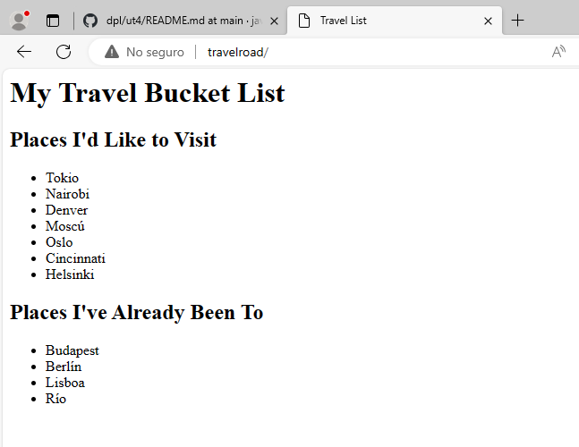

Un problema que puede darse en esta configuración es que, si se intenta acceder a la base de datos de Postgresql antes de que esté el servicio correspondiente levantado, se dará un error de acceso que bloqueará el proceso. 
En este caso será necesario detener los servicios de Nginx y Postgresql, y volver a levantarlos en el orden adecuado: primero Postgresql y después Nginx.

### Preparación del entorno de producción:

#### Crear un repositorio donde alojar la aplicación:

Creamos un repositorio que contenga el proyecto de la aplicación.

Dado que el <b>.gitignore</b> evita que se suban ciertas configuraciones he instalaciones realizadas en la máquina local, es necesario elaborar un guión que se encargue de realizar dichos pasos al desplegar:

	#!/bin/bash

	ssh javiergarcia@azure_vm "
	cd /home/javiergarcia/dpl-ut4-a1
	git pull
	cd travelroad
	composer install
	"

Se deben dar permisos de ejecución:

	chmod +x deploy.sh

Creo el hostname asociado a la ip de mi máquina virtual de Azure:

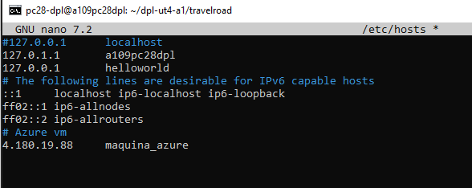

Realizo unos cambios en la plantilla de la aplicación en la máquina local y subo los cambios al repositorio remoto.
A continuación lanzo el script de despliegue:

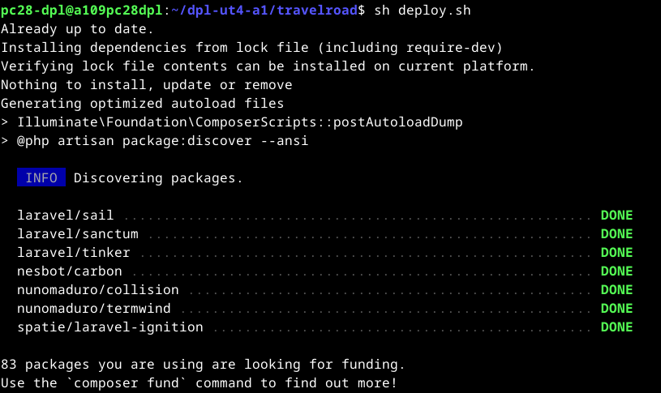

Accedo a la página y compruebo que se ve correctamente:

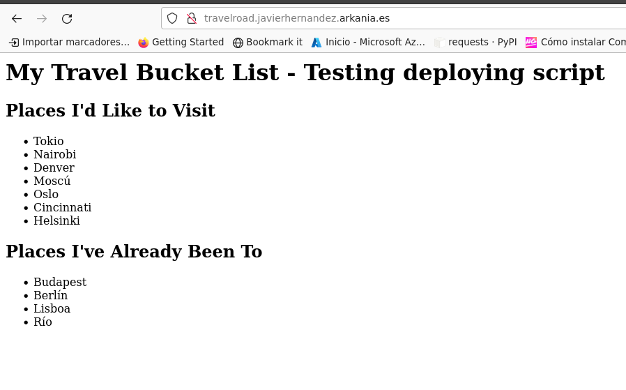

#### Certificado de seguridad TLS (Transport Layer Security) 

Instalo <b>Cerbot</b>:

	sudo apt install -y certbot

Insalo el plugin para nginx:

	sudo apt install -y python3-certbot-nginx

Configuración del certificado para el dominio travelroad.javierhernandez.arkania.es:

	javiergarcia@dpl-javiergarcia-28:~$ sudo certbot --nginx
	Saving debug log to /var/log/letsencrypt/letsencrypt.log
	Enter email address (used for urgent renewal and security notices)
	(Enter 'c' to cancel): javigh1903@movistar.es

	- - - - - - - - - - - - - - - - - - - - - - - - - - - - - - - - - - - - - - - -
	Please read the Terms of Service at
	https://letsencrypt.org/documents/LE-SA-v1.3-September-21-2022.pdf. You must
	agree in order to register with the ACME server. Do you agree?
	- - - - - - - - - - - - - - - - - - - - - - - - - - - - - - - - - - - - - - - -
	(Y)es/(N)o: yes

	- - - - - - - - - - - - - - - - - - - - - - - - - - - - - - - - - - - - - - - -
	Would you be willing, once your first certificate is successfully issued, to
	share your email address with the Electronic Frontier Foundation, a founding
	partner of the Let's Encrypt project and the non-profit organization that
	develops Certbot? We'd like to send you email about our work encrypting the web,
	EFF news, campaigns, and ways to support digital freedom.
	- - - - - - - - - - - - - - - - - - - - - - - - - - - - - - - - - - - - - - - -
	(Y)es/(N)o: n
	Account registered.

	Which names would you like to activate HTTPS for?
	We recommend selecting either all domains, or all domains in a VirtualHost/server block.
	- - - - - - - - - - - - - - - - - - - - - - - - - - - - - - - - - - - - - - - -
	1: pgadmin.javierhernandez.arkania.es
	2: travelroad.javierhernandez.arkania.es
	- - - - - - - - - - - - - - - - - - - - - - - - - - - - - - - - - - - - - - - -
	Select the appropriate numbers separated by commas and/or spaces, or leave input
	blank to select all options shown (Enter 'c' to cancel): 
	Requesting a certificate for pgadmin.javierhernandez.arkania.es and travelroad.javierhernandez.arkania.es

	Successfully received certificate.
	Certificate is saved at: /etc/letsencrypt/live/pgadmin.javierhernandez.arkania.es/fullchain.pem
	Key is saved at:         /etc/letsencrypt/live/pgadmin.javierhernandez.arkania.es/privkey.pem
	This certificate expires on 2024-03-17.
	These files will be updated when the certificate renews.
	Certbot has set up a scheduled task to automatically renew this certificate in the background.

	Deploying certificate
	Successfully deployed certificate for pgadmin.javierhernandez.arkania.es to /etc/nginx/conf.d/pgadmin.conf
	Successfully deployed certificate for travelroad.javierhernandez.arkania.es to /etc/nginx/conf.d/travelroad.conf
	Congratulations! You have successfully enabled HTTPS on https://pgadmin.javierhernandez.arkania.es and https://travelroad.javierhernandez.arkania.es

	- - - - - - - - - - - - - - - - - - - - - - - - - - - - - - - - - - - - - - - -
	If you like Certbot, please consider supporting our work by:
	* Donating to ISRG / Let's Encrypt:   https://letsencrypt.org/donate
	* Donating to EFF:                    https://eff.org/donate-le
	- - - - - - - - - - - - - - - - - - - - - - - - - - - - - - - - - - - - - - - -

Cerbot ha aplicado una serie de cambios en la configuración de los server blocks:

	javiergarcia@dpl-javiergarcia-28:~$ sudo cat /etc/nginx/conf.d/travelroad.conf 
	server {
		server_name travelroad.javierhernandez.arkania.es;
		root /home/javiergarcia/dpl-ut4-a1/travelroad/public;

		index index.html index.php;

		location / {
			try_files $uri $uri/ /index.php?$query_string;
		}
		
		location ~ \.php$ {
			fastcgi_pass unix:/var/run/php/php8.2-fpm.sock;
			fastcgi_param SCRIPT_FILENAME $realpath_root$fastcgi_script_name;
			include fastcgi_params;
		}

		listen 443 ssl; # managed by Certbot
		ssl_certificate /etc/letsencrypt/live/pgadmin.javierhernandez.arkania.es/fullchain.pem; # managed by Certbot
		ssl_certificate_key /etc/letsencrypt/live/pgadmin.javierhernandez.arkania.es/privkey.pem; # managed by Certbot
		include /etc/letsencrypt/options-ssl-nginx.conf; # managed by Certbot
		ssl_dhparam /etc/letsencrypt/ssl-dhparams.pem; # managed by Certbot

	}
	server {
		if ($host = travelroad.javierhernandez.arkania.es) {
			return 301 https://$host$request_uri;
		} # managed by Certbot

		server_name travelroad.javierhernandez.arkania.es;
		listen 80;
		return 404; # managed by Certbot

	}

Efectivamente, ahora podemos acceder a la página a través de https:

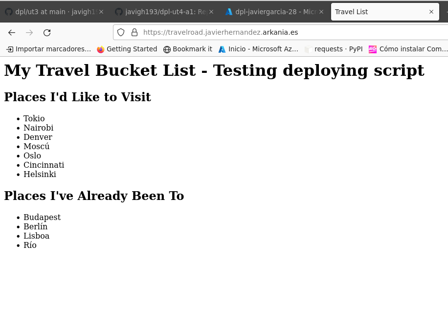

#### Redirección www

Configuramos un server block que redirija 'www.mi_dominio' a 'mi_dominio':

	server {
		server_name www.javierhernandez.arkania.es;
		return 301 https://javierhernandez.arkania.es$request_uri;
	}

Registramos con Cerbot el dominio 'www.mi_dominio' para que se pueda acceder por https.

#### ***Conclusiones***. 

El uso de control de versiones y alojamiento en la nube permite desacoplar facilmente el entorno de desarrollo del entorno de producción. Aunque en esta práctica hemos realizado una 'estrategia' de despliegue muy básica, se podrían definir tareas mucho más potentes que comprueben estados de los dos entornos y realizasen los cambios necesarios en producción para poder implementar los cambios ya consolidados en el entorno de desarrollo.

Otro aspecto de la práctica que me ha parecido muy potente es la automatización de la certificación de los dominios mediante Cerbot.
